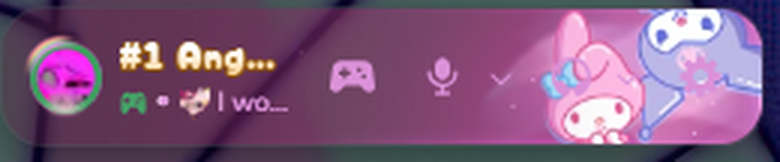
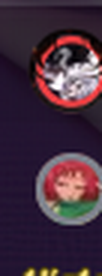
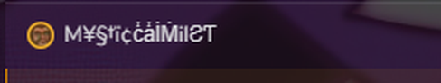
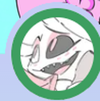
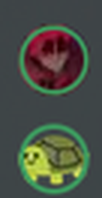

Discord marks someone's status by biting a notch out of the corner of their avatar and
putting a coloured dot in the hole. This puts the corner back and draws the status as a ring
around the whole picture instead. It works everywhere an avatar appears, and it reads the
picture's real size out of the markup, so the ring hugs a 16px avatar in a channel header
and a 120px one in a profile popout without being told about either.

Typing moves onto the picture too. Instead of the dot stretching into a little pill in the
corner, the picture darkens and the dots sit in the middle of it, and everything goes back to
normal on its own when the person stops.

Group DMs get rings too. Discord draws those as two faces sharing one circle, and it crops
both of them to fit. That crop comes off, so each face is a whole circle with a ring, and
the back one keeps its notch where the front sits over it. There is no status on a group
entry, so that ring is a flat colour rather than green or yellow.

Speaking shows as a turning arc. When someone talks, their status ring is replaced by an
arc that rotates around the picture, and it goes back to the ring when they stop. Voice
channel avatars in the sidebar get a resting ring of their own so they are not bare the
rest of the time.

Avatar decorations keep working. They carry the same notch as the picture, so they get the
same treatment and sit in front, uncut.

CSS only. No plugin, nothing to install besides the one line below.

## Screenshots

**User panel**



**Direct message list**



**Channel header**



**Profile popout**



**Member list**



## Install

Paste this into **QuickCSS**.

```css
@import url("https://raw.githubusercontent.com/Just-Me-22/discord-themes/main/circular-status.css");
```

## Values you may want to change

| knob | does |
|---|---|
| `--cs-width` | how thick the ring is |
| `--cs-online` | the green |
| `--cs-idle` | the yellow |
| `--cs-dnd` | the red |
| `--cs-offline` | the grey |
| `--cs-streaming` | the purple |
| `--cs-typing-scrim` | the colour the picture darkens to while someone types |
| `--cs-typing-dim` | how dark that gets |
| `--cs-typing-dots-lift` | how far above centre the typing dots sit |
| `--cs-speaking` | the arc colour while someone is talking |
| `--cs-arc-w` | how thick the arc is |
| `--cs-arc-spin` | how long one full turn takes |
| `--cs-ring` | the resting ring on voice channel avatars |
| `--cs-ring-w` | how thick that resting ring is |
| `--cs-group` | the ring on each face in a group DM avatar |
| `--cs-group-w` | how thick that one is |

The five colours default to Discord's own, so leaving them alone follows your theme. Set
`--cs-typing-dim` to `0` if you want the dots without the picture darkening.

The thickness is a share of the picture rather than a pixel value, and each avatar size
carries its own multiplier on top, so one number holds from a 16px avatar to a 120px one
without the big ones turning into slabs.

The arc only animates while someone is actually speaking, so nothing runs when a channel
is quiet, and it moves with `transform` rather than layout.

Changes apply live. You can edit a knob with Discord open and watch the ring change, no
reload needed.
